# Subterra - Development Guide

This document explains how to set up and run the Subterra system locally for development purposes and outlines our contribution guidelines.

## How to Contribute

We welcome contributions! To maintain code quality and consistency, please follow this workflow:

1. **Fork the Repository**: Create your own copy of the project.
2. **Setup Locally**: Follow the instructions in the [Development Setup](#development-setup) section.
3. **Create a Branch**: Use a descriptive name (e.g., `git checkout -b feature/amazing-feature` or `fix/login-bug`).
4. **Implementation**:
   - Follow the [Code Style and Quality](#code-style-and-quality) guidelines.
   - Write comprehensive tests for new functionality.
5. **Open a Pull Request**: Provide a clear description of your changes and link any relevant issues.


## Development Setup

### Prerequisites
- Docker and Docker Compose
- Node.js and Yarn (for frontend development)

### Backend Setup (Laravel API)

1. **Install Dependencies**
   ```bash
   docker run --rm \
   -u "$(id -u):$(id -g)" \
   -v "$(pwd):/var/www/html" \
   -w /var/www/html \
   laravelsail/php84-composer:latest \
   composer install --ignore-platform-reqs
   ```

2. **Environment Configuration**
   ```bash
   cp .env.example .env
   # Edit .env with your specific configuration
   ```
   
   **Optional: Weather Feature Configuration**
   
   To enable the cave weather feature, you need a Pirate Weather API key:
   1. Sign up for a free API key at [pirateweather.net](https://pirateweather.net)
   2. Add the key to your `.env` file:
      ```
      PIRATE_WEATHER_API_KEY=your_api_key_here
      ```
   3. The weather tab will display "Weather service temporarily unavailable" if no API key is configured.

3. **Start Services**
   ```bash
   vendor/bin/sail up -d
   ```

4. **Database Setup**
   ```bash
   docker exec -it subterra-laravel.test-1 php artisan migrate:fresh --seed
   ```

5. **Generate Application Key**
   ```bash
   docker exec -it subterra-laravel.test-1 php artisan key:generate
   ```

### Frontend Setup (Vue.js)

1. **Install Dependencies**
   ```bash
   cd frontend
   yarn install
   ```

2. **Start Development Server**
   ```bash
   yarn dev
   ```

The frontend will be accessible at `http://localhost:3000`, with the API being proxied through the frontend.

### Authentication Setup

After setting up the application:

1. Follow the OAuth flow and log into the application.
2. Request approval for club membership.
3. Grant admin privileges via tinker: `docker exec -it subterra-laravel.test-1 php artisan tinker`
   ```php
   // Make yourself an admin and approve your account
   $user = User::where('email', 'your@email.com')->first();
   // Or to get the last signed up user after seeding and logging in
   // $user = User::all()->last();
   $user->assignRole('platform_admin');
   $user->assignRole('duty_officer');
   $user->assignRole('data_admin');
   
   // Approve your club membership
   $user->clubs->first()->pivot->status = 'approved'; 
   $user->clubs->first()->pivot->save();
   ```

## Run scheduled tasks
```bash
docker exec -it subterra-laravel.test-1 php artisan schedule:work
```

## API Documentation

The Subterra API provides endpoints for managing caves, cave systems, trips, users, and clubs.

### Authentication
The API uses Laravel Sanctum for authentication. Users authenticate via Google OAuth.

### Core Endpoints

#### Caves
- `GET /api/caves` - List all caves
- `GET /api/caves/{cave}` - Get specific cave details
- `GET /api/caves/{cave}/weather/forecast` - Get current weather and forecast for cave location
- `GET /api/caves/{cave}/weather/historical` - Get historical weather (last 7 days) for cave location
- `POST /api/caves` - Create new cave (admin only)
- `PUT /api/caves/{cave}` - Update cave (admin only)

#### Cave Systems
- `GET /api/cave_systems/{cave_system}` - Get cave system details
- `PUT /api/cave_systems/{cave_system}` - Update cave system (admin only)
- `POST /api/cave_systems_with_cave` - Create cave system with cave (admin only)

#### Trips
- `GET /api/trips` - List all trips
- `POST /api/trips` - Create new trip
- `GET /api/trips/{trip}` - Get trip details
- `PUT /api/trips/{trip}` - Update trip
- `DELETE /api/trips/{trip}` - Delete trip
- `GET /api/me/trips` - Get current user's trips
- `GET /api/me/trips/download` - Download user's trips as CSV

#### Users
- `GET /api/users` - List users
- `GET /api/users/{user}` - Get user details
- `PUT /api/users/{user}` - Update user
- `GET /api/users/{user}/recent-trips` - Get user's recent trips
- `GET /api/users/{user}/activity-heatmap` - Get user's activity heatmap
- `GET /api/users/{user}/medals` - Get user's medals

#### Clubs
- `GET /api/clubs` - List clubs
- `GET /api/clubs/{club}` - Get club details
- `POST /api/clubs/{club}/join` - Request to join club

#### Tags
- `GET /api/tags` - List all tags

### Authorization
The API uses Laravel policies for authorization:
- **CavePolicy**: Manages cave access (admin for create/update)
- **TripPolicy**: Manages trip access (participants can edit their trips)
- **UserPolicy**: Manages user access (users can edit themselves, admins can edit all)
- **ClubPolicy**: Manages club access

## Code Style and Quality

### Code Style
The project uses Laravel Pint for code style enforcement. Ensure your code follows PSR-12 and Laravel best practices:
```bash
docker exec -it subterra-laravel.test-1 vendor/bin/pint
```

### Static Analysis
PHPStan is configured for static analysis. We aim for high-quality, strictly typed code:
```bash
docker exec -it subterra-laravel.test-1 vendor/bin/phpstan analyse
```

### Testing
We believe in strong test coverage. Always add PHP and frontend tests for any new feature or logic bug fix.
Run the test suite:
```bash
docker exec -it subterra-laravel.test-1 php artisan test
```


## Deployment

The system is deployed to fly.io using GitHub actions.

### Database
For an interactive psql shell use `fly postgres connect -a subterra-db`.
For local proxying, use `fly proxy 5433:5432 -a subterra-db`

### DNS
[DNS Settings (Gandi)](https://admin.gandi.net/domain/8e5d26dc-8680-11ef-8ba7-00163e94b645/subterra.world/records)

## Database schema

```mermaid
classDiagram
direction BT
class audits {
   varchar(255) user_type
   bigint user_id
   varchar(255) event
   varchar(255) auditable_type
   bigint auditable_id
   text old_values
   text new_values
   text url
   inet ip_address
   varchar(1023) user_agent
   varchar(255) tags
   timestamp(0) created_at
   timestamp(0) updated_at
   bigint id
}
class callout_participants {
   bigint callout_id
   varchar(255) name
   varchar(255) phone
   varchar(255) email
   timestamp(0) created_at
   timestamp(0) updated_at
   bigint id
}
class callouts {
   bigint user_id
   bigint trip_id
   bigint cave_id
   bigint exit_cave_id
   dateTime callout_time
   text description
   text trip_plan
   varchar(255) car_details
   text team_details
   enum status
   timestamp(0) created_at
   timestamp(0) updated_at
   bigint id
}
class cave_collection {
   bigint collection_id
   bigint cave_id
   timestamp(0) created_at
   timestamp(0) updated_at
   bigint id
}
class cave_system_files {
   bigint cave_system_id
   varchar(255) filename
   text details
   varchar(255) original_filename
   varchar(255) mime_type
   bigint size
   timestamp(0) created_at
   timestamp(0) updated_at
   bigint id
}
class cave_system_tag {
   bigint cave_system_id
   bigint tag_id
}
class cave_systems {
   varchar(255) name
   varchar(255) slug
   text description
   integer length
   integer vertical_range
   text references
   bigint id
}
class cave_tag {
   bigint cave_id
   bigint tag_id
}
class caves {
   varchar(255) name
   varchar(255) slug
   text description
   bigint cave_system_id
   varchar(255) location_name
   varchar(255) location_country
   double precision location_lat
   double precision location_lng
   double precision location_alt
   text access_info
   varchar(255) hero_image
   varchar(255) entrance_image
   bigint id
}
class club_user {
   bigint club_id
   bigint user_id
   boolean is_admin
   timestamp(0) created_at
   timestamp(0) updated_at
   varchar(255) status
   bigint id
}
class clubs {
   varchar(255) name
   varchar(255) slug
   text description
   varchar(255) website
   varchar(255) location
   boolean is_active
   timestamp(0) created_at
   timestamp(0) updated_at
   bigint id
}
class collections {
   bigint user_id
   varchar(255) name
   text description
   varchar(255) photo_path
   boolean is_official
   varchar(255) slug
   timestamp(0) created_at
   timestamp(0) updated_at
   bigint id
}
class huts {
   bigint club_id
   varchar(255) name
   text description
   float location_lat
   float location_lng
   json amenities
   varchar(255) external_url
   text booking_info
   timestamp(0) created_at
   timestamp(0) updated_at
   bigint id
}
class incident_notes {
   bigint incident_id
   bigint user_id
   text content
   timestamp(0) created_at
   timestamp(0) updated_at
   bigint id
}
class incidents {
   bigint callout_id
   enum status
   dateTime resolved_at
   timestamp(0) created_at
   timestamp(0) updated_at
   bigint id
}
class job_batches {
   varchar(255) name
   integer total_jobs
   integer pending_jobs
   integer failed_jobs
   text failed_job_ids
   text options
   integer cancelled_at
   integer created_at
   integer finished_at
   varchar(255) id
}
class jobs {
   varchar(255) queue
   text payload
   smallint attempts
   integer reserved_at
   integer available_at
   integer created_at
   bigint id
}
class medal_user {
   bigint user_id
   bigint medal_id
   timestamp(0) awarded_at
   timestamp(0) created_at
   timestamp(0) updated_at
   bigint id
}
class medals {
   varchar(255) name
   varchar(255) description
   varchar(255) image_path
   timestamp(0) created_at
   timestamp(0) updated_at
   bigint id
}
class on_call_shifts {
   bigint user_id
   dateTime start_at
   dateTime end_at
   timestamp(0) created_at
   timestamp(0) updated_at
   bigint id
}
class role_user {
   bigint role_id
   bigint user_id
   timestamp(0) created_at
   timestamp(0) updated_at
   bigint id
}
class roles {
   varchar(255) name
   varchar(255) slug
   text description
   timestamp(0) created_at
   timestamp(0) updated_at
   bigint id
}
class suggested_edits {
   bigint user_id
   varchar(255) suggestable_type
   bigint suggestable_id
   json original_data
   json suggested_data
   varchar(255) status
   text admin_comment
   timestamp(0) created_at
   timestamp(0) updated_at
   bigint id
}
class tag_groups {
   timestamp(0) created_at
   timestamp(0) updated_at
   bigint id
}
class tag_trip {
   bigint tag_id
   bigint trip_id
   timestamp(0) created_at
   timestamp(0) updated_at
   bigint id
}
class tags {
   varchar(255) tag
   varchar(255) type
   varchar(255) category
   varchar(255) image
   text description
   boolean assignable
   bigint id
}
class trip_media {
   bigint trip_id
   varchar(255) filename
   varchar(255) title
   bigint id
}
class trip_user {
   bigint trip_id
   bigint user_id
}
class trips {
   varchar(255) name
   text description
   bigint cave_system_id
   bigint entrance_cave_id
   bigint exit_cave_id
   timestamp(0) start_time
   timestamp(0) end_time
   bigint id
}
class users {
   varchar(255) name
   varchar(255) email
   varchar(255) photo
   varchar(255) phone
   text bio
   boolean is_active
   json preferences
   timestamp(0) tos_agreed_at
   timestamp(0) privacy_policy_agreed_at
   timestamp(0) created_at
   timestamp(0) updated_at
   bigint id
}

cave_system_tag  -->  cave_systems : cave_system_id.id
cave_system_tag  -->  tags : tag_id.id
cave_tag  -->  caves : cave_id.id
cave_tag  -->  tags : tag_id.id
caves  -->  cave_systems : cave_system_id.id
cave_system_files  -->  cave_systems : cave_system_id.id
club_user  -->  clubs : club_id.id
club_user  -->  users : user_id.id
medal_user  -->  medals : medal_id.id
medal_user  -->  users : user_id.id
tag_trip  -->  tags : tag_id.id
tag_trip  -->  trips : trip_id.id
trip_media  -->  trips : trip_id.id
trip_user  -->  trips : trip_id.id
trip_user  -->  users : user_id.id
trips  -->  cave_systems : cave_system_id.id
trips  -->  caves : entrance_cave_id.id
trips  -->  caves : exit_cave_id.id
audits  -->  users : user_id.id
role_user --> roles : role_id.id
role_user --> users : user_id.id
huts --> clubs : club_id.id
cave_collection --> collections : collection_id.id
cave_collection --> caves : cave_id.id
collections --> users : user_id.id
callouts --> users : user_id.id
callouts --> trips : trip_id.id
callouts --> caves : cave_id.id
callouts --> caves : exit_cave_id.id
callout_participants --> callouts : callout_id.id
incidents --> callouts : callout_id.id
incident_notes --> incidents : incident_id.id
incident_notes --> users : user_id.id
on_call_shifts --> users : user_id.id
suggested_edits --> users : user_id.id

```

