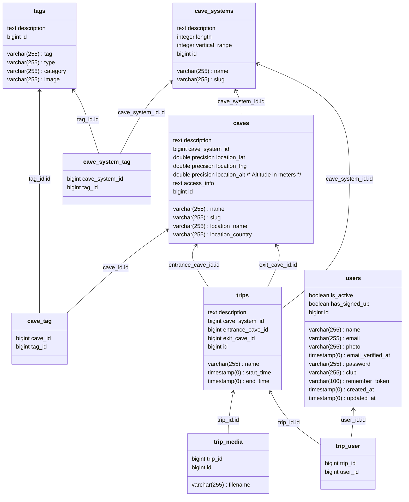

# Subterra 

### [Subterra.world](https://subterra.world) is a tool to help cavers plan upcoming trips and to track trips they've been on.

## Functionality
### Find new trips
The system has a list of cave entrances and systems, with a number of tags added against them. This allows users to filter potential trip options and to find a trip that works for them.
### Track completed trips
Completed trips can be added by a user to help them track their caving career. When entering a trip it's possible to add other trip participants by email. These people are then shown these trips once they log in.

## Development
The system is deployed to fly.io using GitHub pipelines.

### Database
for an interactive psql shell use `fly postgres connect -a subterra-db`.

or for local proxying, use `fly proxy 5433:5432 -a subterra-db`


```
create user subterra_admin with encrypted password '';
ALTER USER subterra_admin WITH SUPERUSER;
```

### Local development
Local development can be accomplished with the dockerfile and node running locally:
```sh
# To start the API server
./vendor/bin/sail up
# To start the ui
cd frontend
yarn run dev
```

### DNS
https://admin.gandi.net/domain/8e5d26dc-8680-11ef-8ba7-00163e94b645/subterra.world/records


## Database schema

