# Subterra 

### [Subterra.world](https://subterra.world) is a tool to help cavers plan upcoming trips and to track trips they've been on.

## Functionality
### Find new trips
The system has a list of cave entrances and systems, with a number of tags added against them. This allows users to filter potential trip options and to find a trip that works for them.
### Track completed trips
Completed trips can be added by a user to help them track their caving career. When entering a trip it's possible to add other trip participants.

## Development Setup

### Prerequisites
- Docker and Docker Compose
- Node.js and Yarn (for frontend development)

### Backend Setup (Laravel API)

1. **Install Dependencies**
   ```bash
   docker run --rm \
   -u "$(id -u):$(id -g)" \
   -v "$(pwd):/var/www/html" \
   -w /var/www/html \
   laravelsail/php84-composer:latest \
   composer install --ignore-platform-reqs
   ```

2. **Environment Configuration**
   ```bash
   cp .env.example .env
   # Edit .env with your specific configuration
   ```

3. **Start Services**
   ```bash
   vendor/bin/sail up -d
   ```

4. **Database Setup**
   ```bash
   docker exec -it subterra-laravel.test-1 php artisan migrate:fresh --seed
   ```

5. **Generate Application Key**
   ```bash
   docker exec -it subterra-laravel.test-1 php artisan key:generate
   ```

### Frontend Setup (Vue.js)

1. **Install Dependencies**
   ```bash
   cd frontend
   yarn install
   ```

2. **Start Development Server**
   ```bash
   yarn dev
   ```

The frontend will be accessible at `http://localhost:3000`, with the API being proxied through the frontend.

### Authentication Setup

After setting up the application:

1. Follow the OAuth flow and log into the application
2. Request approval for club membership
3. Grant admin privileges via tinker:
   ```bash
   docker exec -it subterra-laravel.test-1 php artisan tinker
   
   # Make yourself an admin and approve your account
   $user = User::first(); 
   $user->admin = true; 
   $user->approved = true; 
   $user->save();
   
   # Approve your club membership
   $user = User::first(); 
   $user->clubs->first()->pivot->status = 'approved'; 
   $user->clubs->first()->pivot->save();
   ```

## API Documentation

The Subterra API provides endpoints for managing caves, cave systems, trips, users, and clubs.

### Authentication
The API uses Laravel Sanctum for authentication. Users authenticate via Google OAuth.

### Core Endpoints

#### Caves
- `GET /api/caves` - List all caves
- `GET /api/caves/{cave}` - Get specific cave details
- `POST /api/caves` - Create new cave (admin only)
- `PUT /api/caves/{cave}` - Update cave (admin only)

#### Cave Systems
- `GET /api/cave_systems/{cave_system}` - Get cave system details
- `PUT /api/cave_systems/{cave_system}` - Update cave system (admin only)
- `POST /api/cave_systems_with_cave` - Create cave system with cave (admin only)

#### Trips
- `GET /api/trips` - List all trips
- `POST /api/trips` - Create new trip
- `GET /api/trips/{trip}` - Get trip details
- `PUT /api/trips/{trip}` - Update trip
- `DELETE /api/trips/{trip}` - Delete trip
- `GET /api/me/trips` - Get current user's trips
- `GET /api/me/trips/download` - Download user's trips as CSV

#### Users
- `GET /api/users` - List users
- `GET /api/users/{user}` - Get user details
- `PUT /api/users/{user}` - Update user
- `GET /api/users/{user}/recent-trips` - Get user's recent trips
- `GET /api/users/{user}/activity-heatmap` - Get user's activity heatmap
- `GET /api/users/{user}/medals` - Get user's medals

#### Clubs
- `GET /api/clubs` - List clubs
- `GET /api/clubs/{club}` - Get club details
- `POST /api/clubs/{club}/join` - Request to join club

#### Tags
- `GET /api/tags` - List all tags

### Authorization
The API uses Laravel policies for authorization:
- **CavePolicy**: Manages cave access (admin for create/update)
- **TripPolicy**: Manages trip access (participants can edit their trips)
- **UserPolicy**: Manages user access (users can edit themselves, admins can edit all)
- **ClubPolicy**: Manages club access

## Code Style and Quality

### Code Style
The project uses Laravel Pint for code style enforcement:
```bash
docker exec -it subterra-laravel.test-1 vendor/bin/pint
```

### Static Analysis
PHPStan is configured for static analysis:
```bash
docker exec -it subterra-laravel.test-1 vendor/bin/phpstan analyse
```

### Testing
Run the test suite:
```bash
docker exec -it subterra-laravel.test-1 php artisan test
```

## Contributing

1. Fork the repository
2. Create a feature branch (`git checkout -b feature/amazing-feature`)
3. Make your changes following the code style guidelines
4. Write tests for new functionality
5. Run the test suite to ensure everything passes
6. Run code style checks: `vendor/bin/pint`
7. Commit your changes (`git commit -m 'Add amazing feature'`)
8. Push to the branch (`git push origin feature/amazing-feature`)
9. Open a Pull Request

### Code Standards
- Follow PSR-12 coding standards
- Use strict typing (`declare(strict_types=1)`)
- Write comprehensive tests for new features
- Use proper type hints for all methods
- Follow Laravel best practices

## Deployment

The system is deployed to fly.io using GitHub actions.

### Database
For an interactive psql shell use `fly postgres connect -a subterra-db`.
For local proxying, use `fly proxy 5433:5432 -a subterra-db`

### DNS
https://admin.gandi.net/domain/8e5d26dc-8680-11ef-8ba7-00163e94b645/subterra.world/records


## Database schema

```mermaid
classDiagram
direction BT
class audits {
   varchar(255) user_type
   bigint user_id
   varchar(255) event
   varchar(255) auditable_type
   bigint auditable_id
   text old_values
   text new_values
   text url
   inet ip_address
   varchar(1023) user_agent
   varchar(255) tags
   timestamp(0) created_at
   timestamp(0) updated_at
   bigint id
}
class cache {
   text value
   integer expiration
   varchar(255) key
}
class cache_locks {
   varchar(255) owner
   integer expiration
   varchar(255) key
}
class cave_system_files {
   bigint cave_system_id
   varchar(255) filename
   text details
   varchar(255) original_filename
   varchar(255) mime_type
   bigint size
   timestamp(0) created_at
   timestamp(0) updated_at
   bigint id
}
class cave_system_tag {
   bigint cave_system_id
   bigint tag_id
}
class cave_systems {
   varchar(255) name
   varchar(255) slug
   text description
   integer length
   integer vertical_range
   text references
   bigint id
}
class cave_tag {
   bigint cave_id
   bigint tag_id
}
class caves {
   varchar(255) name
   varchar(255) slug
   text description
   bigint cave_system_id
   varchar(255) location_name
   varchar(255) location_country
   double precision location_lat
   double precision location_lng
   double precision location_alt  /* Altitude in meters */
   text access_info
   varchar(255) hero_image
   varchar(255) entrance_image
   bigint id
}
class club_user {
   bigint club_id
   bigint user_id
   boolean is_admin
   timestamp(0) created_at
   timestamp(0) updated_at
   varchar(255) status
   bigint id
}
class clubs {
   varchar(255) name
   varchar(255) slug
   text description
   varchar(255) website
   varchar(255) location
   boolean is_active
   timestamp(0) created_at
   timestamp(0) updated_at
   bigint id
}
class failed_jobs {
   varchar(255) uuid
   text connection
   text queue
   text payload
   text exception
   timestamp(0) failed_at
   bigint id
}
class job_batches {
   varchar(255) name
   integer total_jobs
   integer pending_jobs
   integer failed_jobs
   text failed_job_ids
   text options
   integer cancelled_at
   integer created_at
   integer finished_at
   varchar(255) id
}
class jobs {
   varchar(255) queue
   text payload
   smallint attempts
   integer reserved_at
   integer available_at
   integer created_at
   bigint id
}
class medal_user {
   bigint user_id
   bigint medal_id
   timestamp(0) awarded_at
   timestamp(0) created_at
   timestamp(0) updated_at
   bigint id
}
class medals {
   varchar(255) name
   varchar(255) description
   varchar(255) image_path
   timestamp(0) created_at
   timestamp(0) updated_at
   bigint id
}
class migrations {
   varchar(255) migration
   integer batch
   integer id
}
class tag_groups {
   timestamp(0) created_at
   timestamp(0) updated_at
   bigint id
}
class tag_trip {
   bigint tag_id
   bigint trip_id
   timestamp(0) created_at
   timestamp(0) updated_at
   bigint id
}
class tags {
   varchar(255) tag
   varchar(255) type
   varchar(255) category
   varchar(255) image
   text description
   boolean assignable
   bigint id
}
class trip_media {
   bigint trip_id
   varchar(255) filename
   bigint id
}
class trip_user {
   bigint trip_id
   bigint user_id
}
class trips {
   varchar(255) name
   text description
   bigint cave_system_id
   bigint entrance_cave_id
   bigint exit_cave_id
   timestamp(0) start_time
   timestamp(0) end_time
   bigint id
}
class users {
   varchar(255) name
   varchar(255) email
   varchar(255) photo
   boolean is_active
   boolean is_approved
   timestamp(0) created_at
   timestamp(0) updated_at
   boolean is_admin
   text bio
   bigint id
}

cave_system_tag  -->  cave_systems : cave_system_id.id
cave_system_tag  -->  tags : tag_id.id
cave_tag  -->  caves : cave_id.id
cave_tag  -->  tags : tag_id.id
caves  -->  cave_systems : cave_system_id.id
cave_system_files  -->  cave_systems : cave_system_id.id
club_user  -->  clubs : club_id.id
club_user  -->  users : user_id.id
medal_user  -->  medals : medal_id.id
medal_user  -->  users : user_id.id
tag_trip  -->  tags : tag_id.id
tag_trip  -->  trips : trip_id.id
trip_media  -->  trips : trip_id.id
trip_user  -->  trips : trip_id.id
trip_user  -->  users : user_id.id
trips  -->  cave_systems : cave_system_id.id
trips  -->  caves : entrance_cave_id.id
trips  -->  caves : exit_cave_id.id
audits  -->  users : user_id.id

```
