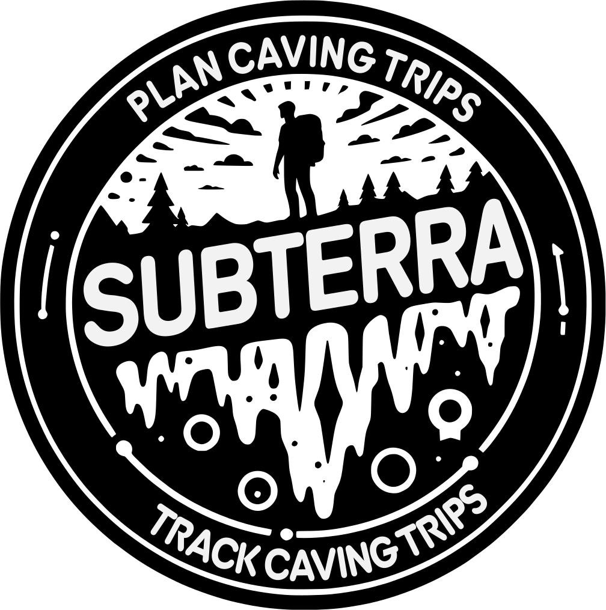

# Subterra 

### [Subterra.world](https://subterra.world) is a tool to help cavers plan upcoming trips and to track trips they've been on.

## Functionality

### Find new trips
The system has a list of cave entrances and systems, with a number of tags added against them. This allows users to filter potential trip options and to find a trip that works for them.

### Track completed trips
Completed trips can be added by a user to help them track their caving career. When entering a trip it's possible to add other trip participants.

## Get Involved

Subterra is an open-source project and we welcome contributions from the caving and development community.

### For Cavers
- Use the site at [Subterra.world](https://subterra.world).
- Add your trips and help build the database.
- Report bugs or suggest features via GitHub Issues.

### For Developers
If you'd like to contribute code:

1. **Local Setup**: Please refer to the [Development Guide](DEVELOPMENT.md) for instructions on how to run the system locally.
2. **Workflow**:
   - Fork the repository.
   - Create a feature branch (`git checkout -b feature/amazing-feature`).
   - Make your changes following the code style guidelines.
   - Write tests for new functionality.
   - Open a Pull Request.

### Code Standards
- Follow PSR-12 coding standards.
- Use strict typing where appropriate.
- Write comprehensive tests for new features.
- Follow Laravel and Vue.js best practices.

## License

Subterra is open-source software.