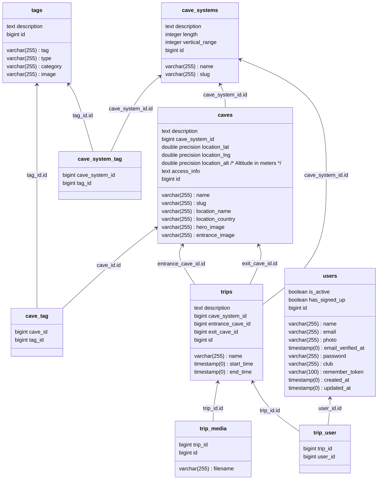

# Subterra 

### [Subterra.world](https://subterra.world) is a tool to help cavers plan upcoming trips and to track trips they've been on.

## Functionality
### Find new trips
The system has a list of cave entrances and systems, with a number of tags added against them. This allows users to filter potential trip options and to find a trip that works for them.
### Track completed trips
Completed trips can be added by a user to help them track their caving career. When entering a trip it's possible to add other trip participants.

## Deployment
The system is deployed to fly.io using GitHub pipelines.

### Database
for an interactive psql shell use `fly postgres connect -a subterra-db`.

or for local proxying, use `fly proxy 5433:5432 -a subterra-db`
```
create user subterra_admin with encrypted password '';
ALTER USER subterra_admin WITH SUPERUSER;
```

### Local development
You'll need Docker installed locally.

Local development can be accomplished with the dockerfile and node running locally:
```sh
docker run --rm \
-u "$(id -u):$(id -g)" \
-v "$(pwd):/var/www/html" \
-w /var/www/html \
laravelsail/php84-composer:latest \
composer install --ignore-platform-reqs


# The following command doesn't require PHP to be installed
vendor/bin/sail up

# Run the migration
docker exec -it subterra-laravel.test-1 php artisan migrate:fresh --seed

# Login to the application then update your user
$user = User::first(); $user->is_admin = true; $user->is_approved = true; $user->save();
# Manually approve your user's club status
$user = User::first(); $user->clubs->first()->pivot->status = 'approved'; $user->clubs->first()->pivot->save();
```

The frontend can then be accessed on `http://localhost:3000`, with the api being proxied through the frontend.

### DNS
https://admin.gandi.net/domain/8e5d26dc-8680-11ef-8ba7-00163e94b645/subterra.world/records


## Database schema

