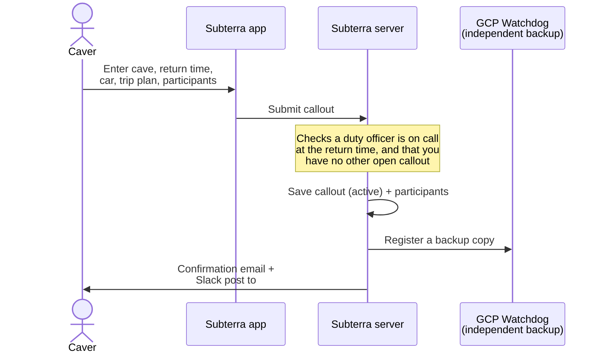
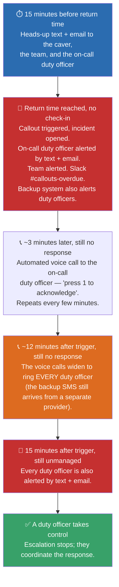
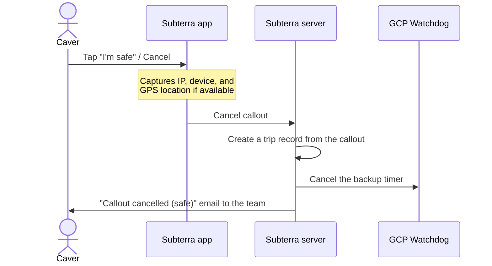
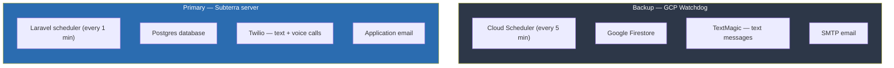
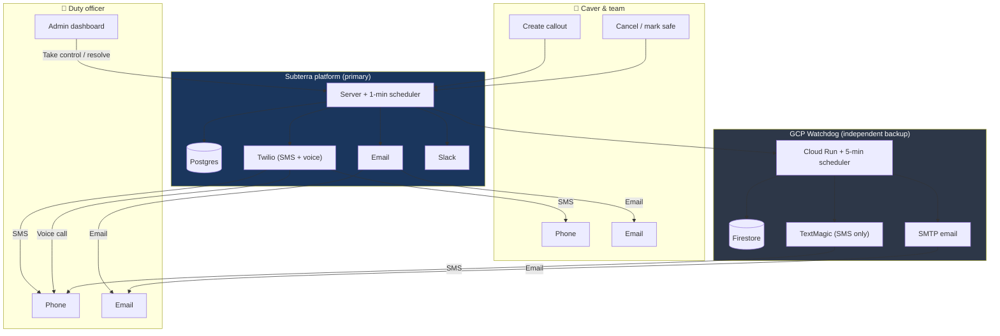

# How the Callout System Works

This is the **full technical reference** for Subterra's callout system. If you just want to understand callouts as a caver, read [Callouts explained](/pages/callouts-explained). If you're a volunteer on the rota, read the [Duty Officer Guide](/pages/duty-officer-guide). All three pages follow the same structure — this one simply goes into the most depth.

A callout is a safety net for cavers underground. Before a trip you record where you're going and when you expect to be back. If you don't check in by that time, the system automatically alerts a duty officer (a trained volunteer on call) and begins an escalating emergency response.

---

## What a callout is

Every callout is watched by **three independent layers**. If any one layer fails, the others keep working.

1. **Subterra server** — the primary application. A scheduled task runs every minute, checking for callouts that are due soon, overdue, or unmanaged.
2. **GCP Watchdog** — a completely separate backup hosted on Google Cloud. It stores its own copy of each callout and checks every five minutes, using a *different* phone provider and email system.
3. **Duty officer rota** — real volunteers who have agreed to be on call and respond when an alert fires.

The two automated systems share no infrastructure, and behind them is a human who is expecting to be called.

---

## Setting a callout

When you submit a callout through the app:

A callout **can only be created if a duty officer is on call** at the expected return time. If nobody is covering that slot, the system refuses and tells you why.

The caver's own number must also be **verified** — they confirm it once by entering a 6-digit code we text them (changing the number requires re-verifying). A verified phone is likewise required to join the duty-officer rota, so the safety-critical contact data is known-good and reachable.

Backup coverage is **mandatory**: a callout must be watched by *both* the primary Subterra scheduler **and** the independent GCP backup. If the backup can't be registered, the callout is **not created** — the creation is rolled back and you're asked to try again. This guarantees a callout is never left watched by only one system, but it does mean a backup outage prevents new callouts being set until it recovers. (When the backup isn't configured at all — for example in local development — this check is skipped.)

Subterra also refuses a callout if it couldn't actually raise the alarm: if essential alerting configuration is missing, or if **either SMS provider's credit is below a safe minimum**, the callout is rejected. A credit-block also fires a Slack alert — auto-top-up should keep credit from ever running out, so this is a belt-and-braces guard. (A balance Subterra can't read never blocks, so a balance-API outage can't take callouts down.)

### What you provide

| Field | Required | Purpose |
|---|---|---|
| Cave / location | Yes | So rescuers know where to look |
| Expected return time | Yes | The deadline — if you're not back, alerts fire |
| Trip plan | Yes | Route details for rescue teams |
| Vehicle registration | Yes | To identify your car at the parking spot |
| Car parking location | Yes | Where rescuers should start looking |
| Participants | Yes (≥1) | Everyone underground, with phone numbers |

---

## While the trip is underway

Once a callout is active, two independent systems watch the clock. You don't need to do anything underground.

- The **Subterra server** runs a scheduled check **every minute** (guarded so two runs can't overlap), looking for callouts that are due in ~15 minutes, past their return time, or unmanaged for 15 minutes after triggering.
- The **GCP Watchdog** checks its own records **every five minutes** and will alert duty officers independently if a callout goes overdue.

---

## When a callout goes overdue

The response escalates in clear stages. Every stage stops the moment someone checks in or a duty officer takes control.

The on-call duty officer gets the early calls **to themselves** — the first about 3 minutes after triggering, repeating every few minutes. Because Twilio is the only voice channel, the calls then **widen to ring every duty officer at about 12 minutes** — well before the full text-and-email escalation at 15 minutes — so an overdue incident becomes very hard to miss, while the backup SMS still arrives from an entirely separate provider.

### The 15-minute warning

Fifteen minutes before the return time, the system sends a heads-up to the caver, the participants, **and** the on-call duty officer (sent once):

- **To participants (text):** *"Your callout is close. Please mark yourself safe or reply OUT SAFE."*
- **To the duty officer (text):** *"ALERT: Callout at [cave] due in 15 mins (HH:MM). Please stand by."*

### Acknowledging

A duty officer becomes the **Incident Controller** — which stops the voice escalation — in any of three ways, all sharing the same logic:

- **Press 1** on the automated voice call.
- **Reply `ACK`** to the alert text.
- Click **Acknowledge** on the incident in the admin dashboard.

---

## Marking safe

When the caver is safely out:

If a rescue is **already underway** (an incident exists), marking safe does **not** close the incident — it adds a system note ("user marked themselves safe") and leaves it open for a duty officer to verify and close. This prevents a false "all clear" during an active rescue.

If cancelling the backup timer fails, the watchdog may still fire a duplicate alert — a false alarm is treated as far safer than a missed emergency.

---

## Why you can trust it

### Two independent monitoring systems

The two systems share **no infrastructure** — different servers, different databases, different schedulers, and crucially **different phone providers** (Twilio for the primary, TextMagic for the backup). A total outage at one phone provider cannot silence all alerts, because the other system reaches phones through the other provider. Both systems must fail independently, at the same time, for an alert to be missed.

A separate monitor (running every 15 minutes) continuously checks that the backup is reachable and tracking the same callouts, and raises a Slack alert if the two diverge, if any active callout lacks backup coverage, or if **either SMS provider's credit drops below its minimum** — so a loss of redundancy (or of credit) is surfaced proactively, not only when someone next tries to set a callout.

### Fail-safe, not fail-secure

If anything goes wrong, the system errs toward raising the alarm rather than staying silent.

| Scenario | What happens |
|---|---|
| Backup registration fails | Callout is **not created** — creation rolls back and the caver is asked to retry, so a callout is never watched by only one system |
| A text/email fails when a callout triggers | The triggered status and incident are saved to the database **before** any alert is sent, and each alert goes out in isolation — one failed recipient or provider never rolls back the incident or stops the other alerts |
| Email or Slack fails | Callout **still created** — these are secondary to text/voice |
| Subterra server goes down | The GCP Watchdog independently alerts duty officers via TextMagic + SMTP |
| Backup cancellation fails when marking safe | The watchdog may still fire — a false alarm beats a missed emergency |
| An SMS provider runs out of credit | New callouts are **refused** (and a Slack alert fires) rather than accepting a callout the system can't alert on. Auto-top-up should prevent this ever happening |

### Knowing the alarm can actually be raised

Two things are checked so a callout is never accepted that the system couldn't act on, and so problems surface loudly:

- **SMS credit.** The remaining credit on both providers (Twilio and TextMagic) is read and shown on the Callout Dashboard. If either drops below a safe minimum, new callouts are blocked and a Slack alert is raised — both at the moment of a blocked callout and proactively from the 15-minute monitor. Auto-top-up should keep this from ever firing.
- **Delivery tracking.** Every outbound primary (Twilio) SMS is recorded and Twilio reports its delivery status back, so the incident page shows whether each alert reached its recipient (delivered / failed). The backup provider does not report receipts.

### Alerting is synchronous by design

Alerts are sent **inline** within the scheduled run, not handed to a background queue worker. A queued alert depends on a separate worker staying alive; if that worker died, alerts would pile up silently — a worse failure than sending inline. The inline path is protected by bounded timeouts (a hung provider can't stall the check), automatic retries on transient failures, per-recipient isolation, and overlap protection (a slow run can't be restarted by the next minute's tick).

### Phone calls are made by a human

The system sends automated texts, emails, and "press 1" voice calls, but **calls to actually check on the party are made by the duty officer**. An automated robocall can't assess a situation; a person can ask questions, judge tone, and make decisions.

### Data privacy

Callout data contains sensitive personal information (phone numbers, vehicle details, locations). Resolved callouts are automatically scrubbed after 30 days, leaving only the anonymised trip record.

### Monthly backup testing

On the 1st of each month, a synthetic test callout is run through the full backup pipeline to confirm the GCP Watchdog can still deliver text and email. The test alert is sent to a **dedicated test phone and email address, not the duty officer rota** — so duty officers won't personally receive it, and a quiet inbox doesn't mean the test isn't running. (Verify it via the watchdog logs or the test contact.)

---

## Complete system diagram

Note that the **caver and team are contacted by the primary system only** (SMS + email for the 15-minute warning and the overdue trigger), and the **automated voice calls go only to duty officers**. The backup system contacts **duty officers only**, by SMS and email.

---

## Summary

| Feature | How it works |
|---|---|
| **Creation** | Submit via app → confirmed by email; requires a duty officer on call |
| **15-min warning** | Text + email to the caver, team, and on-call duty officer |
| **Overdue trigger** | Incident opened; on-call duty officer alerted (text + email + Slack) |
| **Voice escalation** | ~3 min later, repeating "press 1" calls to the on-call duty officer |
| **Full escalation** | 15 min unmanaged → every duty officer alerted and called |
| **Backup monitoring** | Independent GCP Watchdog on a different phone provider |
| **SMS credit** | Both providers' balances shown on the dashboard; low credit blocks new callouts + alerts Slack |
| **Delivery tracking** | Primary (Twilio) SMS delivery status shown per recipient on the incident page |
| **Marking safe** | Cancels the countdown → creates a trip record |
| **Data privacy** | Sensitive data scrubbed after 30 days |

A missed alert requires **both** the Subterra server **and** the GCP Watchdog to fail independently at the same time — and even then, a duty officer is expecting to be on standby.
