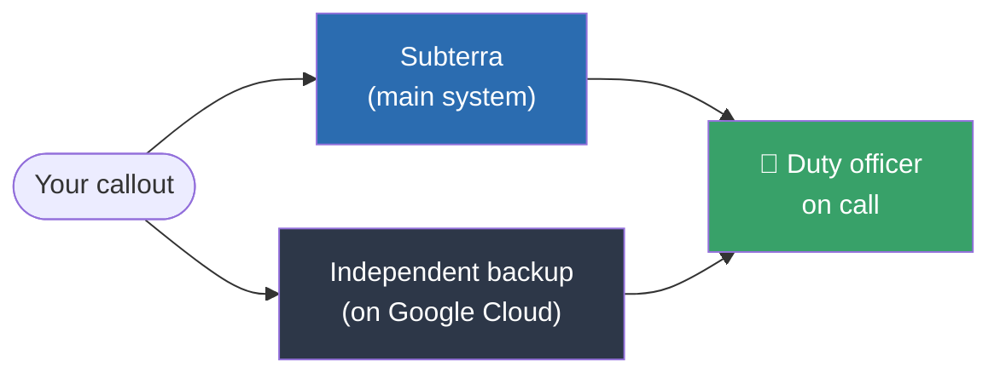

# Callouts explained

A callout is your underground safety net. Before a trip you tell Subterra where you're going and when you expect to be back. If you don't check in by then, Subterra automatically alerts a **duty officer** — a trained volunteer who is on call — and they can start a rescue.

> This is the plain-English overview. Volunteers on the rota should read the [Duty Officer Guide](/pages/duty-officer-guide), and there's a [full technical write-up](/pages/callout-system) if you want every detail. All three follow the same structure.

---

## What a callout is

Think of a callout as a countdown with someone watching it. You set an expected return time; Subterra watches the clock; and if the time passes without you checking in, it raises the alarm for you. You can't always call for help yourself from underground — a callout means you don't have to.

## Setting a callout

In the app you tell us:

- **Where** you're going (cave or location) and **where you've parked**
- **Who** is with you, and their phone numbers
- **When** you expect to be back

A callout can only start if a duty officer is on call to cover your return time. If nobody is on call, the app will tell you — leave your plans with a trusted friend instead.

## While the trip is underway

There's nothing for you to do underground. Subterra watches the clock for you — in fact **two independent systems** do, so a single failure can't leave you unwatched.

## When a callout goes overdue

If you haven't checked in, the response builds up in stages — and **stops the instant you mark yourself safe**:

1. **15 minutes before** your return time — you and your team get a text and email nudge: *mark yourself safe, or reply OUT SAFE if you're already out.*
2. **At your return time**, if you haven't checked in — a duty officer is alerted by text and email, and a callout is raised.
3. **A few minutes later**, if the duty officer hasn't responded — Subterra phones them automatically.
4. **If there's still no response**, the calls ring *every* duty officer, and within 15 minutes they're all alerted by text and email too — until someone takes charge.

## Marking safe

When you're back above ground, open your callout and tap **"I'm safe"** (or reply **OUT SAFE** to the text). That cancels the countdown and turns your callout into a trip record.

If a rescue has already started, marking safe doesn't call it off automatically — a duty officer will check and confirm you're safe first.

## Why you can trust it

Two completely separate systems watch every callout: Subterra itself, and an independent backup running on Google Cloud. They use **different servers and different phone companies**, so even if one phone provider has an outage, the other can still raise the alarm. Behind both is a rota of real duty officers expecting to be called.

Subterra also checks it can actually reach people *before* it accepts your callout — it won't start one unless the alerting system is ready to raise the alarm.

## Your data

A callout holds sensitive details — phone numbers, your car, where you parked, your location. Once a callout is resolved, Subterra automatically **scrubs that personal information after 30 days**, keeping only an anonymised record of the trip.

> **Please note:** a callout is a best-effort safety net, **not** a guaranteed or emergency service, and it doesn't replace telling a trusted person your plans. See the [Terms of Service](/pages/terms-of-service) for details.
