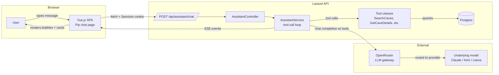
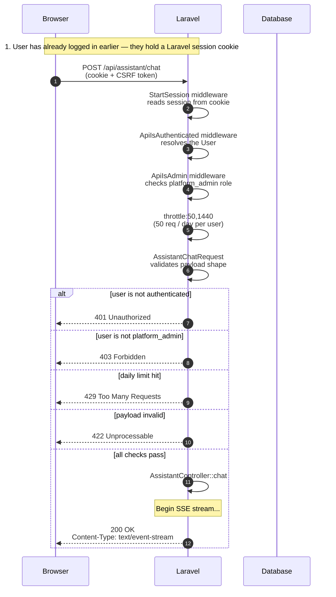
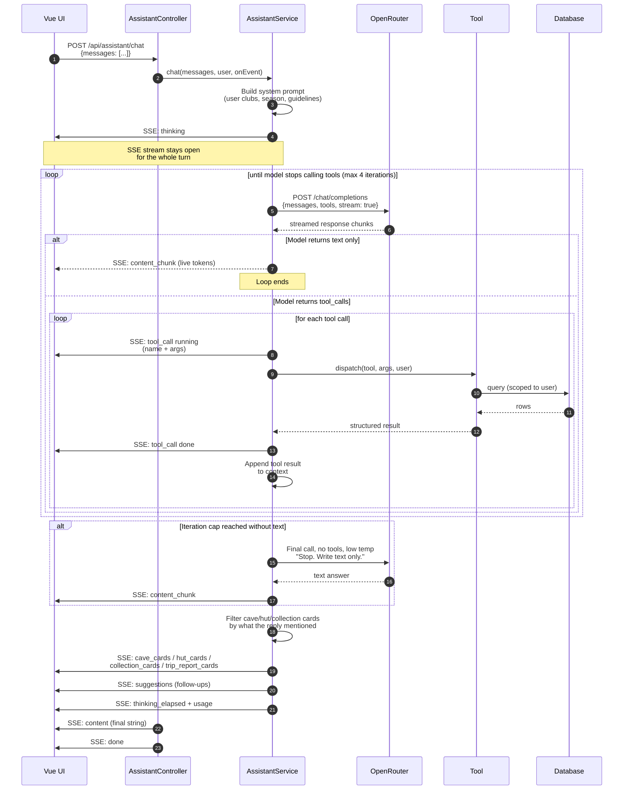
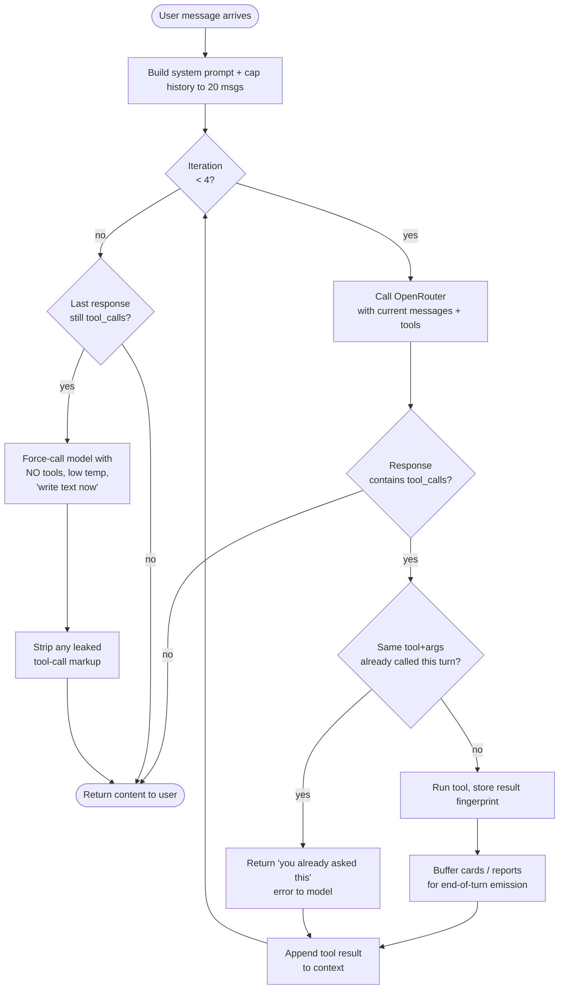
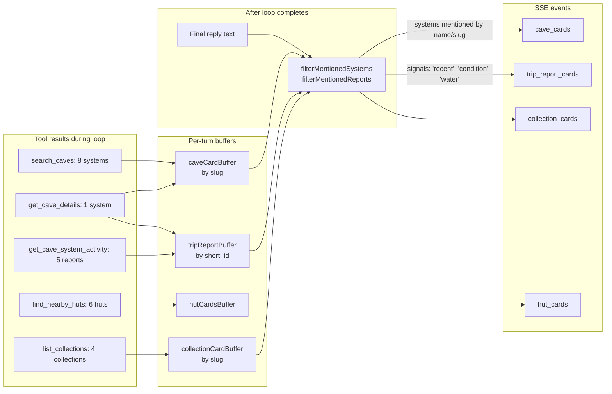
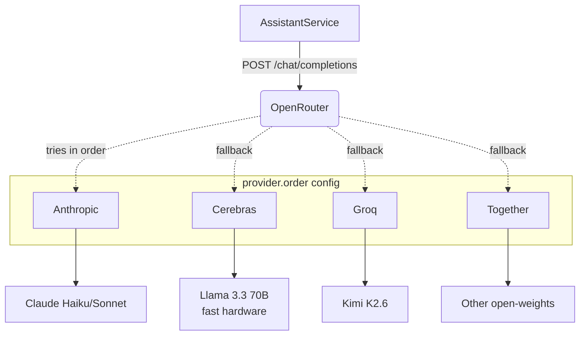

# AI Assistant Architecture

A walkthrough of how the Pip assistant works end-to-end: how requests are
authenticated, how a single chat turn flows through the system, and how the
results stream back to the user.

## The pieces



The frontend never talks to OpenRouter directly. The OpenRouter API key lives
in the Laravel `.env` and is never exposed to the browser. Every model call
goes through your own Laravel backend, which lets us:

- Authenticate the user (Sanctum) before any model tokens are spent
- Run real tool calls (cave search, weather, etc.) against the database
- Sanitise the model's output before it reaches the UI
- Bill / rate-limit per user
- Swap models or providers without redeploying the frontend

---

## How auth works

The chat endpoint is a normal authenticated Laravel API route, gated by the
same Sanctum SPA session as the rest of the app. The chat is admin-only
during the preview, so an extra middleware layer enforces the
`platform_admin` role.



A few things worth noting about the auth model:

- **Session cookie auth, not bearer tokens.** Same as the rest of the SPA —
  Laravel Sanctum's "stateful API" mode. The CSRF cookie is fetched once on
  app load and the browser sends it on every mutating request.
- **Admin gate is in middleware, not the controller.** This means a missing
  role rejects the request *before* the controller (and thus the model call)
  is ever reached. No tokens spent on unauthorised requests.
- **Rate limit is per user-id, daily.** Even an admin can't accidentally rack
  up a huge bill from one tab — `throttle:50,1440` is 50 requests in any
  rolling 24-hour window, keyed by user.
- **`session()->save()` is called inside the streaming callback** to release
  Laravel's session lock so other tabs can hit the API while a long stream is
  in flight. Without this, an SSE response in one tab blocks `/api/users/me`
  in another tab.

---

## A single chat turn

Here's what happens when you send one message. The "agentic loop" — the
back-and-forth where the model decides which tools to call — is the most
interesting part.



Three subtle bits worth understanding:

1. **The model never sees the database.** Tools are the only bridge. The
   model returns a JSON object saying "call `search_caves` with these args";
   our PHP code runs the actual query and feeds the result back as a "tool"
   message. The model can't run arbitrary SQL.
2. **The loop is bounded.** `max_tool_iterations: 4` in `config/assistant.php`
   caps how many tool ↔ model round-trips can happen per turn. Without this,
   a model could spend tokens forever.
3. **SSE means the UI gets typewriter-style streaming for free.** The
   `content_chunk` events are delivered token-by-token as OpenRouter
   produces them, which is what makes the response feel responsive even
   though the model can take 10–30 seconds to finish.

---

## Tool dispatch & the agentic loop

Zooming into the loop body. This is the core of `AssistantService::chat`.



Several defensive measures live in this loop because LLM behaviour is messy:

- **Per-turn dedup**: a `callKey = name + canonicalised(args)` fingerprint
  catches small models that retry the same `search_caves` call with slightly
  different tag casing. Identical calls return a sharp "stop, you already
  asked this" message instead of re-running.
- **Forced final answer**: if the model exhausts its tool budget without
  ever producing text, we make one more call with `tools` omitted and
  `tool_choice: 'none'`. Without this, the user would see an empty response
  or a stale "I was unable…" fallback.
- **Output sanitiser**: certain models (DeepSeek variants especially) leak
  tool-call markup like `<｜｜DSML｜｜tool_calls>...` into their text content.
  `sanitiseAssistantText` anchors at the first such token and drops
  everything after. If the entire reply was markup, the user gets a friendly
  fallback message.

---

## Card emission

Cards (cave / hut / collection / trip-report) are the rich UI elements that
appear under each reply. They aren't sent inline with the text — they ride
on separate SSE events. This separation lets the model write a flowing
prose answer while the UI surfaces structured links and images alongside.



The mention-filter is the bit that stops the UI being flooded. If the model
called `search_caves` to look up a cave's ID for a follow-up tool call, we
*do not* show those 10 results as cards — only the cave the model actually
named in its prose reply. Hut cards are different: if `find_nearby_huts`
ran at all, the user clearly asked about huts, so all results are surfaced.

---

## OpenRouter & provider routing

OpenRouter is a single OpenAI-compatible HTTP endpoint that proxies to many
underlying model providers. We use it because:

- One API, many models — swap from Claude to Kimi to Llama with an env var
- Per-key spending caps protect against runaway costs
- Provider routing lets us pin to faster or cheaper backends per model



The `provider` block in `config/assistant.php` builds an `order: [...]`
array that's sent on every request. Setting
`ASSISTANT_PROVIDER_ORDER=Anthropic` in your `.env` pins requests to
Anthropic direct (lower latency for Claude). Leaving it empty lets
OpenRouter auto-pick the cheapest available provider for the model.

---

## Configuration knobs

Most behaviour can be tuned without touching code. The interesting ones in
`config/assistant.php`:

| Key                                  | What it does                                                          |
| ------------------------------------ | --------------------------------------------------------------------- |
| `openrouter.api_key`                 | Your OpenRouter key (from `OPENROUTER_API_KEY` in `.env`)             |
| `openrouter.model`                   | Which model to use, e.g. `anthropic/claude-haiku-4-5`                 |
| `openrouter.max_tokens`              | Cap on response length                                                |
| `openrouter.temperature`             | 0.0 = deterministic, 1.0 = creative                                   |
| `provider.order`                     | Comma-list of preferred providers (`ASSISTANT_PROVIDER_ORDER`)        |
| `streaming`                          | `false` disables SSE — useful for tests, eval CLI                     |
| `limits.max_history_messages`        | How many prior messages to send to the model (default 20)             |
| `limits.max_tool_iterations`         | Tool-call rounds per turn before forced final answer (default 4)      |

The route itself in `routes/api.php` controls auth and rate-limit:

```php
Route::post('/assistant/chat', [AssistantController::class, 'chat'])
    ->middleware([ApiIsAuthenticated::class, ApiIsAdmin::class])
    ->middleware('throttle:50,1440')
    ->name('assistant.chat');
```

---

## Where things live

If you want to read the code:

| Concern                      | File                                                                     |
| ---------------------------- | ------------------------------------------------------------------------ |
| Route + auth                 | `routes/api.php`                                                         |
| Request shape validation     | `app/Http/Requests/AssistantChatRequest.php`                             |
| SSE streaming + error events | `app/Http/Controllers/AssistantController.php`                           |
| Tool-call loop, sanitiser    | `app/Services/AssistantService.php`                                      |
| Tools                        | `app/Services/Assistant/Tools/*.php`                                     |
| Frontend chat shell          | `frontend/src/pages/admin/assistant.vue`                                 |
| Event handling, history      | `frontend/src/stores/assistant.js`                                       |
| Card components              | `frontend/src/components/{Cave,Hut,Collection,TripReport}AssistantCard.vue` |
| Markdown + map rendering     | `frontend/src/components/MarkdownRenderer.vue`                           |
| Eval CLI                     | `app/Console/Commands/AssistantEvalCommand.php`                          |
| Eval dataset                 | `tests/AssistantEval/dataset.json`                                       |
