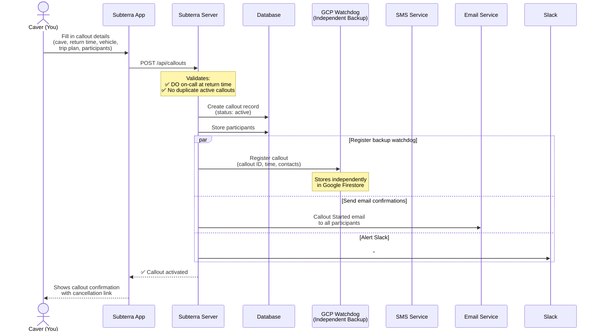
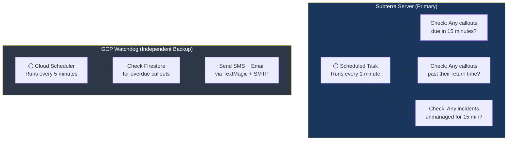
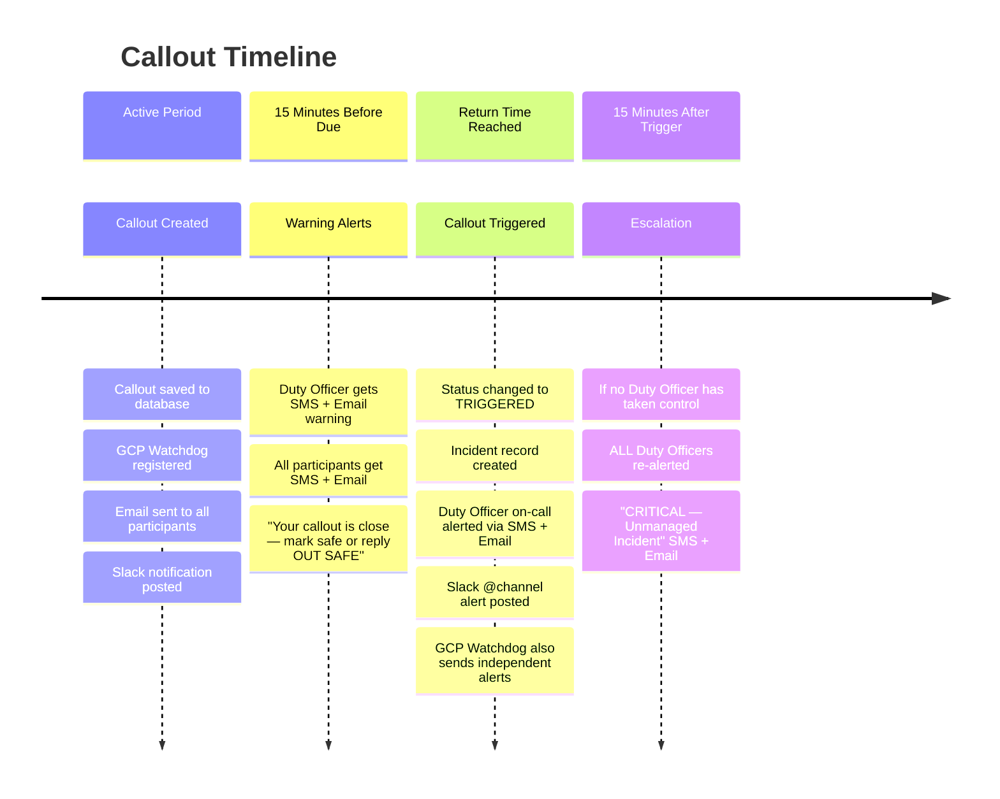
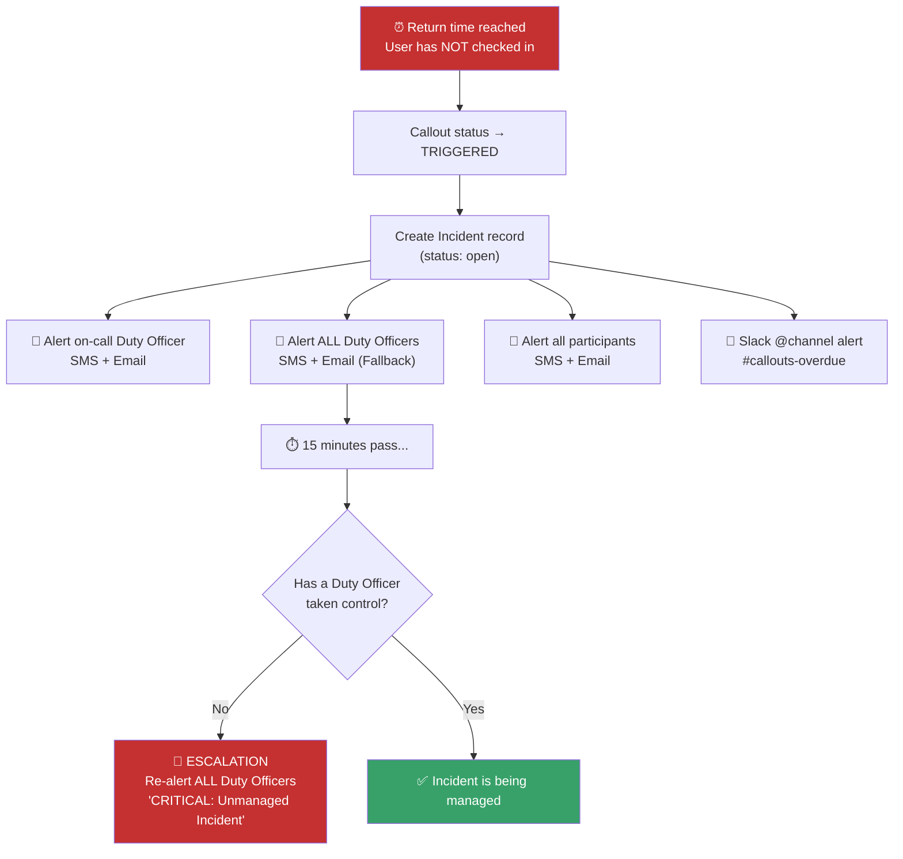
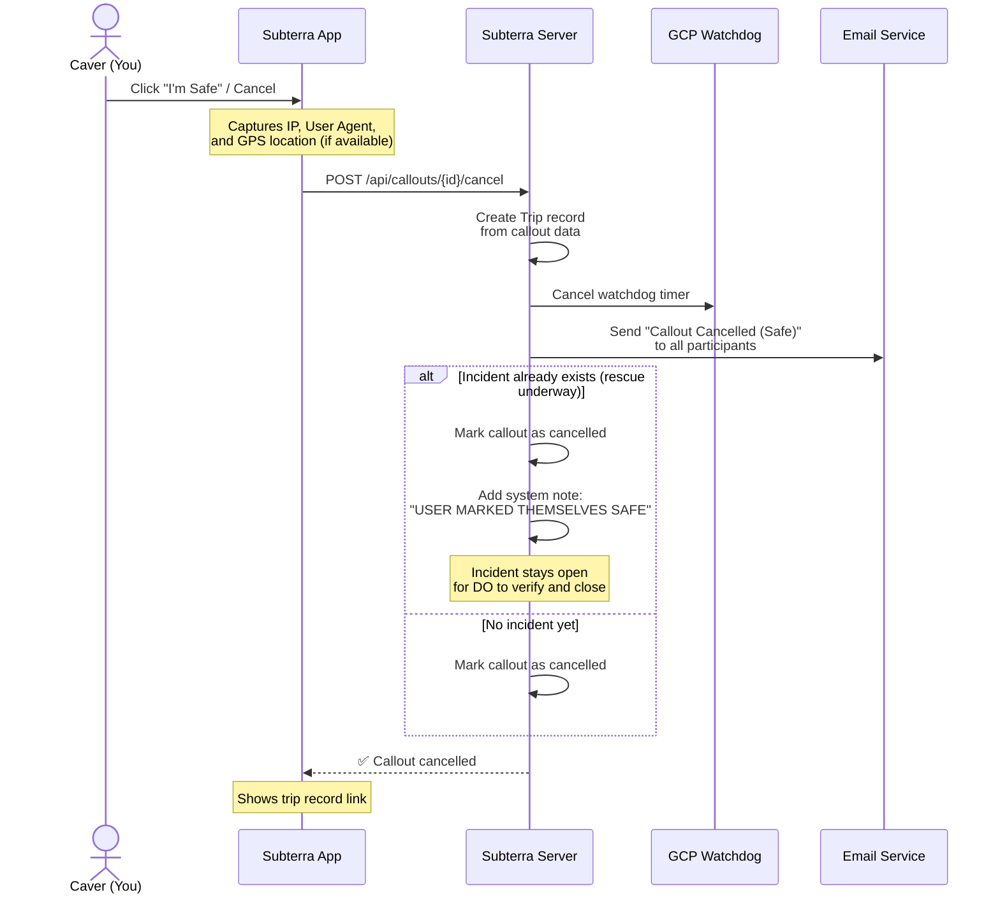
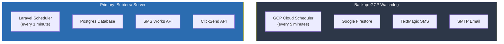
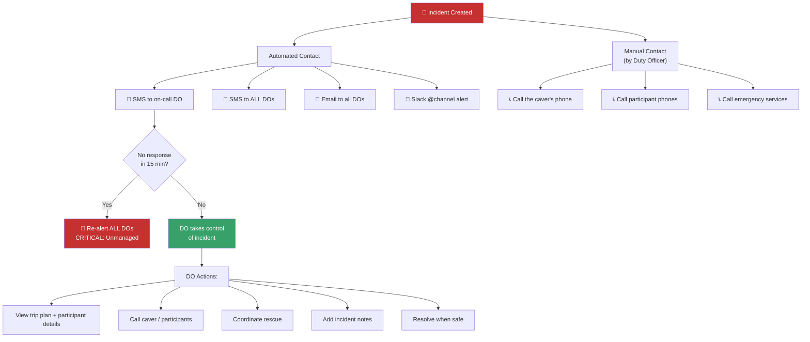
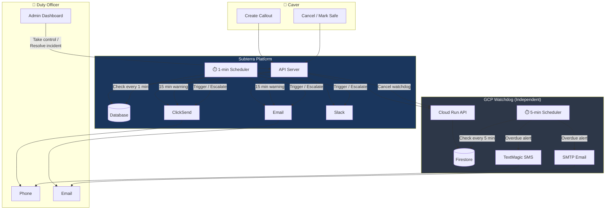

# How the Callout System Works

Subterra's callout system is designed to keep cavers safe underground. When you set a callout, you're creating a safety net — if you don't check in by your expected return time, the system will automatically alert Duty Officers and begin an emergency response.

This document explains exactly how the system works, the design decisions behind it, and why you can trust it.

---

## Overview

The callout system has **three independent layers** that monitor your safety:

1. **Subterra Server** — primary application, running scheduled checks every minute
2. **GCP Watchdog** — a completely separate, cloud-hosted backup system on Google Cloud
3. **Duty Officer Rota** — real humans on-call who are responsible for responding

If any one layer fails, the others continue to function independently.

---

## The Callout Lifecycle

### Creating a Callout

When you submit a callout through the app, the following happens:

### What You Need to Provide

| Field | Required | Purpose |
|---|---|---|
| Cave / Location | Yes | So rescuers know where to look |
| Expected return time | Yes | The deadline — if you're not back, alerts fire |
| Trip plan | Yes | Route details for rescue teams |
| Vehicle registration | Yes | To locate your car at the parking spot |
| Car parking location | Yes | Where rescuers should start looking |
| Participants | Yes (≥1) | Everyone underground, with phone numbers |

---

## While You're Underground

Once your callout is active, two independent systems are watching the clock:

> **Why two systems?** If Subterra goes down (server crash, database issue, network outage), the GCP Watchdog operates entirely independently — different server, different database, different SMS provider. It will still send alerts.

---

## The Timeline: What Happens and When

---

## 15-Minute Warning

Fifteen minutes before your return time, the system sends a heads-up to both you and the Duty Officer:

**To the Duty Officer:**
> *ALERT: Callout at [Cave Name] due in 15 mins (HH:MM). Please stand by. Subterra.*

**To you and your participants (SMS):**
> *Your callout is close. Please mark yourself safe or reply "OUT SAFE"*

**To you and your participants (Email):**
> *Your registered callout is due in approximately 15 minutes. If you are safe out of the cave, please check in IMMEDIATELY to prevent a rescue callout from being initiated.*

This gives everyone time to act before the full alert triggers.

---

## When the Clock Runs Out (Triggering)

If nobody checks in by the return time, the system escalates automatically:

---

## Cancelling a Callout (Marking Safe)

When you're safely out of the cave:

**Important:** If a rescue is already underway (an incident exists), cancelling your callout does **not** close the incident. The Duty Officer must verify you are safe and close it manually. This prevents false "all clear" signals during an active rescue.

---

## Design Decisions: Why It Works This Way

### 1. Fail-Safe, Not Fail-Secure

The system is designed to **fail safe** — meaning if anything goes wrong, it errs on the side of raising the alarm rather than staying silent.

| Scenario | What happens |
|---|---|
| GCP Watchdog registration fails | Callout **still created** — Subterra server monitors it independently |
| Email fails to send | Callout **still created** — email is secondary to SMS |
| Slack fails | Callout **still created** — Slack is informational only |
| Subterra server goes down | GCP Watchdog **independently** monitors and alerts via TextMagic SMS + SMTP email |
| Watchdog cancellation fails (when you mark safe) | Watchdog may still fire — a false alarm is better than a missed emergency |

### 2. Two Independent Monitoring Systems

The two systems share **no infrastructure**:
- Different servers (Fly.io hosting vs Google Cloud Run)
- Different databases (Postgres vs Firestore)
- Different SMS providers (SMS Works/ClickSend vs TextMagic)
- Different email systems (application email vs direct SMTP)
- Different schedulers (Laravel cron vs GCP Cloud Scheduler)

Both must independently fail for an alert to be missed.

### 3. Duty Officer Rota

A callout can only be created if there is a Duty Officer on-call at the expected return time. This is checked at creation time — if nobody is covering that time slot, the system refuses to create the callout and tells you why.

Duty Officers are real people who have agreed to be available. When an alert fires, they receive automated SMS and emails. During an active incident, the system expects a Duty Officer to "take control" of the incident within 15 minutes. If nobody does, every Duty Officer gets an escalation alert.

### 4. Contact During an Incident

Communication during an incident works in layers:

The system provides automated text alerts, but **phone calls to check on the party are done manually by the Duty Officer**. This is intentional — an automated robocall can't assess a situation; a real person can ask questions, judge tone of voice, and make decisions.

### 5. Data Privacy

Callout data contains sensitive personal information (phone numbers, vehicle details, location data). The system automatically scrubs this data from resolved callouts after 30 days, retaining only the anonymised trip record.

### 6. Monthly Watchdog Testing

The GCP Watchdog is tested monthly with a synthetic test alert (`watchdog:test-alert`) to verify the entire backup pipeline is functioning. This sends a test callout through the watchdog that triggers within 1 minute, confirming SMS and email delivery without involving real emergency contacts.

---

## Complete System Diagram

---

## Summary

| Feature | How it works |
|---|---|
| **Callout creation** | Submit via app → confirmed via Email |
| **15-min warning** | Automated SMS + Email to you AND the Duty Officer |
| **Overdue trigger** | Automated alert to On-Call Duty Officer + Slack |
| **Backup monitoring** | Independent GCP Watchdog with its own SMS + Email |
| **Escalation** | 15 min after trigger with no response → re-alert everyone |
| **Cancellation** | Mark safe in-app → watchdog cancelled → trip record created |
| **Data privacy** | Sensitive data scrubbed after 30 days |
| **Monthly testing** | Synthetic test alert through full watchdog pipeline |

The system is designed so that the only way an alert is missed is if **both** the Subterra server **and** the GCP Watchdog independently fail at the same time — and even then, the Duty Officer rota means a real person is expecting to be on standby.
